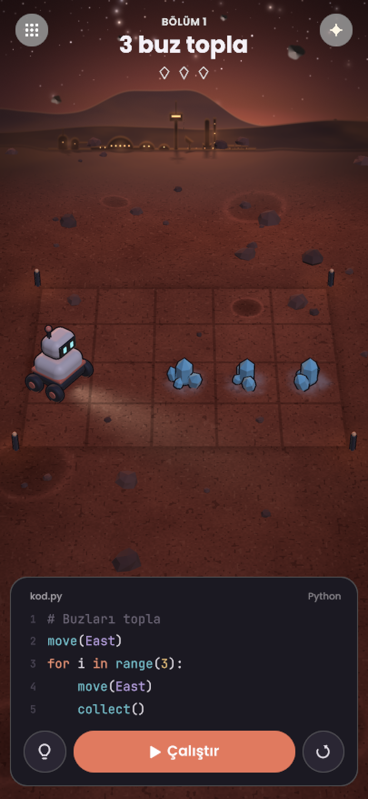

# Gün Sonu Raporu — Enes, 26 Eylül 2026

**Konu:** Unity ile ilk görsel taslak (**unitytaslak1**)
**Nerede:** `prototipler/unity/` · Açmak için `prototipler/unity/calistir.bat` dosyasına çift tıklamak yeterli.
**Görüntüler:** `docs/tasarim/unitytaslak1-bekleme.png`, `-toplama.png`, `-bitti.png`, `-yildizsiz.png`

## Kısaca
Bugün oyunun ilk Unity taslağını yaptık. Godot taslaklarındaki "çok efekt, çok manzara" sorununun tersinden gittik: sade, koyu, premium hissettiren bir oyun ekranı. Ekranda bir bölüm baştan sona oynanıyor: robot kodu satır satır çalıştırıyor, 3 buzu topluyor, bölüm tamamlanıyor.

## Ekranda ne var?
- **Oyun alanı:** Mars yüzeyine gömülü 5×4 karelik bir bölge. Satranç tahtası gibi değil; tek parça tozlu, taneli, çakıllı Mars toprağı. Kare sınırları zeminde ince, soluk çizgiler, köşelerde küçük ışıklı işaret direkleri var. Buzların çevresi buzlanmış, bir karede küçük bir krater var.
- **Çevre:** Aynı zemin her yöne devam ediyor. Kayalar ve kraterler serpiştirilmiş, uzaklaştıkça sadeleşiyor ve ufuktaki tepelere dikişsiz karışıyor. Zemin küçük bir gezegen yüzeyi gibi uzakta hafifçe kıvrılıyor, böylece perspektif tutarlı.
- **Arka plan (koyu tema):** Mars'ta şafaktan hemen önce. Güneş görünmüyor, büyük tepenin ardından turuncu ışıltısı taşıyor. Güneşe yakın yıldızlar sönük, yukarı çıktıkça sıklaşıyor ve rastgele parlıyor. Gökyüzünde küçük sabit kayalar (Phobos vb.) ve yavaşça geçen bir uydu var.
- **Koloni:** Ufukta kubbeler ve tüpler, su işleme depoları, ışıklı kontrol kulesi, radar çanağı, rampasında roket, güneş panelleri, sırayla yanan pist ışıkları. Binaların gölgeleri bize doğru uzanıyor. Üzerinden hafif bir kum fırtınası sisi geçiyor, koloni ışıkları sisin içinde hafif hale yapıyor.
- **Robot:** Tombul, oyuncak gibi, ince dış çizgili. Göz kırpıyor, sürerken başını bize çeviriyor. Farları gibi, gittiği yöne hafif ışık düşürüyor. Buz alınca kafasını eğiyor, sonda bize dönüp iki kez zıplıyor.
- **Arayüz:** Üstte "Bölüm 1 / 3 buz topla" ve üç küçük buz simgesi (toplandıkça doluyor). Altta koyu bir kod kartı: çalışan satır yanıyor. Düğmeler: ipucu, Çalıştır, baştan al. Sağ üstteki ✦ düğmesi yıldızları açıp kapatıyor.
- **Işık gerçekçi:** Zemin güneşe (uzağa) doğru hafifçe aydınlanıyor, kameraya doğru kararıyor. Oyun alanı "güneş alıyor" gibi parlak değil.

## Alınan kararlar
- **Motor: Unity.** Taslak Unity 6 ile yapıldı.
- **Koyu tema**, yumuşak (cırtlak olmayan) renkler, koyu kod kartı.
- **Oyun alanı = Mars yüzeyi.** Tahta, fayans, satranç deseni yok; alan havada da durmuyor, çevresiyle aynı hizada. Hedef görünüm Ragıp'ın godottaslak2'sine yakın.
- **Gerçekçilik esas:** Işık, gölge, parlaklık ve uzaklık birbiriyle tutarlı olmalı.
- **Referanslar:** The Farmer Was Replaced (ana esin, tanıtım videosu ve ekran görüntüleri incelendi) ve MyRisale (eğitim ekranları için). **Pocket Chess referansı tamamen kaldırıldı.** Ayrıntılar: `docs/referanslar/BENIOKU.md`.

## Denenip vazgeçilenler (neden şimdiki hâline geldiğini anlamak için)
- Açık renkli, iki renkli "satranç tahtası" → Mars'a uymadı, kaldırıldı.
- Havada duran kalın toprak bloğu → çevresine göre saçma durdu, zemine gömüldü.
- Samanyolu şeridi → beğenilmedi, kaldırıldı.
- Kameranın tepeden bakması → alan ile koloni farklı açılardan görünüyordu, kamera alçaltıldı.

## Bilinmesi gerekenler
- Koddaki Python bu taslakta **gerçekten çalışmıyor**, önceden hazırlanmış bir gösteri oynuyor. Asıl Python motorumuzun Unity'ye taşınması ayrı ve büyük bir iş.
- Robot, buzlar, kayalar hazır model değil, kodla şekillendirildi: lisans derdi yok, dosya boyutu küçük.
- Henüz **telefonda denenmedi.** Arka plandaki ayrıntılar telefonu yorabilir; bunu ve uygulama boyutunu Android paketi (APK) ile göreceğiz.

## Sıradaki adım
1. Ekip olarak taslağa bakıp yorum yapmak.
2. Android paketi (APK) üretip gerçek telefonda denemek: akıcılık ve dosya boyutu.
3. Görünüm onaylanırsa Python motorunu Unity'ye taşımaya başlamak.
