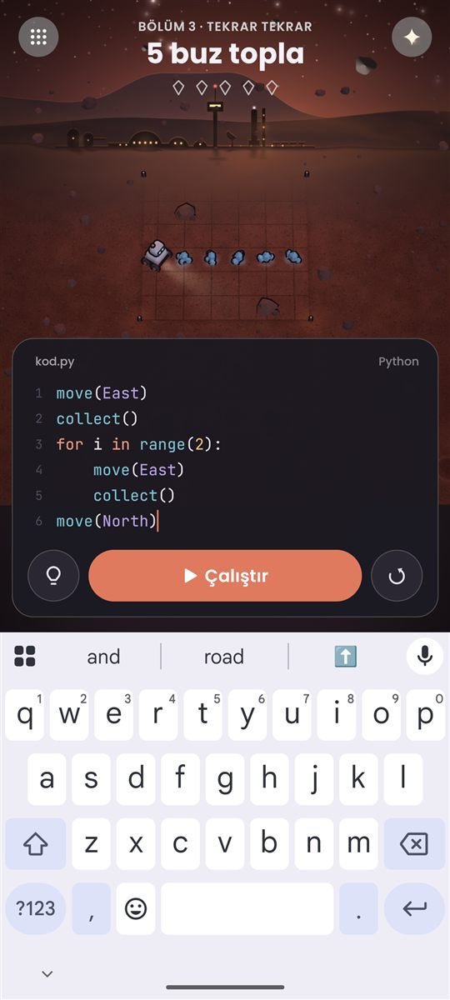
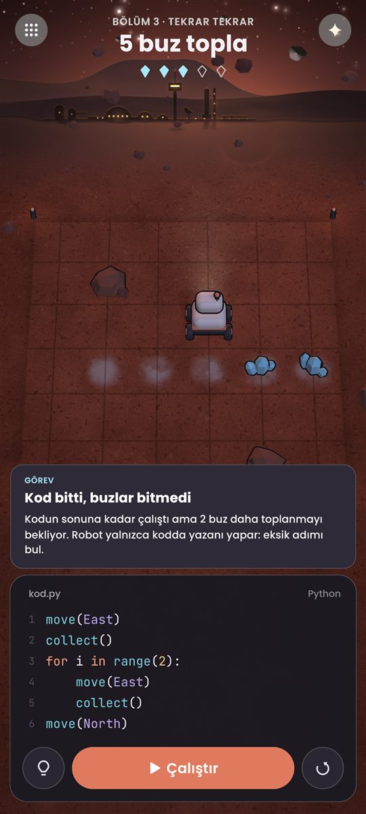

# Gün Sonu Raporu — 27-28 Eylül 2026 (Ragıp)

> Enes ve Hamza için: dün gece ve bugün neler yapıldı, yarın devralan kişi nereden başlamalı.
> Kısa özet `ILERLEME.md`'de; burası ayrıntılı hâli.

## Kısaca
1. **Bölümler artık dosyadan geliyor:** İlk 3 bölüm, kod bilmeyen birinin de yazabileceği küçük dosyalar olarak hazır. Her bölümün doğru çözümünü bir denetleyici otomatik olarak çalıştırıp kontrol ediyor.
2. **Oyuncu artık kendi kodunu yazabiliyor:** Kod kartına dokununca telefon klavyesi açılıyor; yazılan kod gerçekten çalışıyor ve bölüm bölüm telefonda saklanıyor. Sanal telefonda baştan sona denendi.
3. **İki inatçı "siyah ekran" sorunu kalıcı olarak çözüldü:** Telefonda robotun simsiyah görünmesi ve telefon paketinden sonra bilgisayar paketinin siyah çıkması.

---

## 1. Bölümler dosyadan (27 Eylül gece)
- İlk 3 bölüm `oyun/Assets/Resources/Bolumler/` klasöründe (`bolum-01.json` … `bolum-03.json`).
- Harita "resim gibi" yazılıyor: `R` robot, `B` buz, `K` kaya, `H` hedef kare, `.` boş kare. Kılavuz: `docs/tasarim/bolum-dosyasi.md`.
- Yeni oyun kuralları: **kaya engeli** (robot kayaya çarpıp duruyor), **hedef kare** (robot orada bitirmeli), **kilitli komut** (bölümde henüz açılmamış bir komutu kullanmak).
- **Bölüm denetleyici:** Her bölümün doğru çözümünü çalıştırıyor. Dosyada yazan "tipik hataların" gerçekten hatalı olduğunu da kontrol ediyor. İlk çalışmada gerçek bir açık yakaladı: son buzu toplayıp sonra alanın dışına çıkan kod "görev tamam" sayılıyordu; düzeltildi.
- Bölüm sırası (karar): Bölüm 1 yalnızca `move`; Bölüm 2 `move` + `collect`; Bölüm 3'te aynı işi tekrar tekrar yazmak yorsun, `for` döngüsü ihtiyaçtan doğsun.

## 2. Kod yazma alanı (28 Eylül)
Oyuncu artık hazır çözümü değil, **kendi yazdığı kodu** çalıştırıyor.

| Klavye açık, `for` döngüsü yazılıyor | Kod çalıştı |
|---|---|
|  |  |

**Neler var:**
- **Bölümün başlangıç kodu:** Bölüm açılınca kartta bölüm dosyasındaki başlangıç kodu duruyor. Oyuncu bunu değiştiriyor.
- **Kod saklanıyor:** Her bölümün kodu telefonda ayrı saklanıyor; oyun kapatılıp açılınca oyuncu kaldığı yerden devam ediyor.
- **Yazarken renkli kod** korunuyor. İmleç kalın, turuncu ve yanıp sönüyor; seçilen yazı turuncu.
- **Klavye açılınca** kod kartı klavyenin üstüne kayıyor, oyun alanı kalan yere küçülüyor. Oyun alanına dokununca klavye kapanıyor.
- **Girinti kolaylıkları:** Python'da `for` gibi satırlardan sonra gelen satırlar 4 boşluk içeriden yazılmalı. Telefon klavyesinde bunu elle yapmak zor olduğu için:
  - `:` ile biten satırdan sonra Enter'a basınca yeni satır kendiliğinden 4 boşluk içeriden başlıyor.
  - Geri silme tuşu girintiyi tek seferde bir kademe (4 boşluk) geri alıyor.
  - Bilgisayarda Tab tuşu 4 boşluk ekliyor.
  - Böylece Bölüm 3, hiç boşluk tuşuna basmadan yazılabiliyor.
- **Kod çalışırken değiştirilemiyor.** Çalıştırdıktan sonra kodu değiştirince robot başa dönüyor, kırmızı satır ve hata kutusu kayboluyor.

**Telefonda bulunup düzeltilen sorunlar** (bilgisayarda görünmüyordu; sanal telefonda deneyince çıktı):
1. Klavye her satırı büyük harfle başlatıyordu (`move` yerine `Move`, Python bunu tanımaz). Seçilen klavye türünden kaynaklanıyordu, değiştirildi.
2. Koda dokununca kodun tamamı seçiliyordu; basılan ilk harf bütün kodu siliyordu. Kapatıldı.
3. Otomatik girinti telefonda çalışmıyordu: telefon klavyesi yazının kendi kopyasını tutuyor ve bizim eklediğimiz boşlukları hemen geri eziyordu. Önce klavyeye yeni yazı bildiriliyor, sonra imleç taşınıyor.

## 3. Siyah ekran sorunları (kalıcı çözüm)
- **Telefonda robot ve buzlar simsiyah görünüyordu.** Asıl sebep: ışıklı nesneler telefonda hiç çizilmiyordu; siyah görünen yalnızca dış çizgileriydi. Bunu, bilgisayar ayarında açık olan "GPU Resident Drawer" adlı bir çizim hızlandırıcısı yapıyordu. Bu hızlandırıcı binlerce nesneli sahneler içindir, bizim küçük sahnemize bir yararı yok. İki ayarda da kapatıldı.
- **Telefon paketinden sonra bilgisayar paketi siyah çıkıyordu.** Unity telefon paketini üretirken bir ayar dosyasından telefonun kullanmadığı parçaları siliyor. Sonraki bilgisayar paketi de bu parçalar olmadan, siyah üretiliyordu. Artık paket üretici (`OyunBuild.cs`) önce hedef platforma geçiyor ve her üretimden sonra ayar dosyasını eski hâline getiriyor. Telefon → bilgisayar sırasıyla denendi, ikisi de düzgün. **Artık elle bir şey geri almak gerekmiyor.**

## 4. Sayılar
- **1053 otomatik test** geçiyor (dün 1003'tü).
- Telefon paketi **31 MB**: `paketler/marskod-oyun.apk` güncellendi. Arkadaşlar buradan kurabilir (kurulum `paketler/BENIOKU.md`).

## 5. Eksik kalanlar (acil değil)
- Çok uzun bir satır kartın sağından taşıyor (yana kaydırma yok).
- Kod çok uzarsa kart büyüyüp oyun alanını küçültüyor (kartta kaydırma yok).
- "Başlangıç koduna dön" düğmesi yok.

---

## Yarın devralan kişi için
**Nereden başlanacak:** Aşama 3'ün kalanı: **adım adım modu**, **3 kademeli ipucu**, **bölüm seçme ekranı**. Yapım planı `docs/superpowers/plans/2026-09-25-marskod-yapim-plani.md`.

**Claude'a ilk mesaj** (yeni sohbet; model **Opus**, efor **orta-yüksek**):
> Merhaba, ben [adın]. ILERLEME.md'deki sıradaki adımla devam edelim: Aşama 3'ün kalanı (adım adım modu, 3 kademeli ipucu, bölüm seçme ekranı). Önce hangisinden başlamamızı önerirsin?

Claude adını duyunca GitHub'dan güncel hâli çeker, `ILERLEME.md`'yi okur ve durumu özetler.

**Bilgisayarında olması gerekenler:**
- **Unity 6 (6000.6.x) ve Android desteği:** Unity Hub'dan kurulur; oyunu açmak ve paket üretmek için.
- **.NET:** Otomatik testler için (`motor-test` klasöründe `dotnet test`).
- **Sanal telefon:** Telefonda denemek istersen gerekir. Claude kurulumda yardım eder.

**Bilmen iyi olan iki not:**
- Sanal telefon uzun süre açık kalınca oyun ekranı boş kalabiliyor. Bu oyunun değil, sanal telefonun grafik sorunu; sanal telefonu kapatıp açmak düzeltiyor.
- Sanal telefonda klavye araya "kalem deneme" penceresi açarsa Claude'a söyle, kapatır.

**Gün sonunda:** "Bugünlük bitti" de; Claude günün özetini senin adınla `ILERLEME.md`'ye yazar ve GitHub'a yükler.
